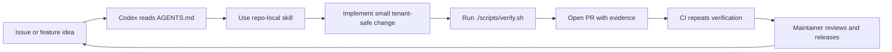
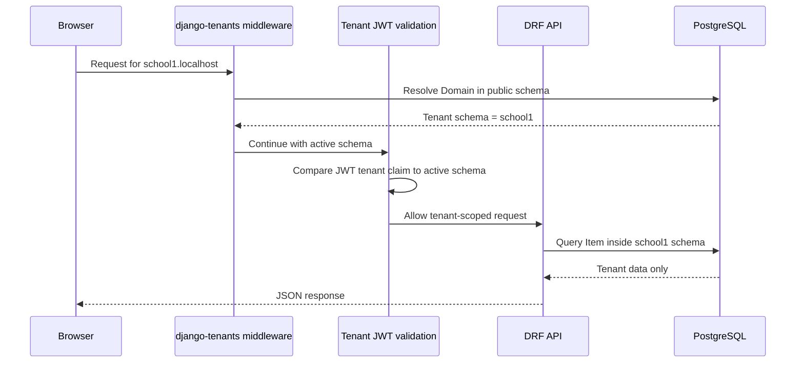

# Codex-First Django Multi-Tenant SaaS Starter

[](https://github.com/mohamedBalkhi/Django-Multi-Tenant-SaaS-Starter-Template/actions/workflows/ci.yml)
[](https://www.djangoproject.com/)
[](https://www.postgresql.org/)
[](AGENTS.md)
[](LICENSE)

A Django starter for B2B SaaS teams that need real PostgreSQL schema isolation and a repository that is ready for human-plus-agent maintenance from the first clone.

It combines `django-tenants`, Django REST Framework, Simple JWT, Docker, pytest, GitHub CI, repo-local agent skills, Codex prompts, and contributor workflows into one maintainable template.

## Why This Exists

Most starter templates help you boot an app once. This one is designed for the work that comes after the first demo: tenant-safe changes, issue triage, pull request review, release checks, documentation drift, and repeatable verification.

The goal is not "AI-generated Django code." The goal is a Django repository that gives Codex and maintainers the same map, commands, safety rules, and review loop.

## What Makes It Codex-First

| Layer | What ships in the repo | Why it matters |
| --- | --- | --- |
| Instructions | [`AGENTS.md`](AGENTS.md) | Gives coding agents the project map, safety invariants, and required checks. |
| Skills | [`.agents/skills/`](.agents/skills) | Reusable workflows for tenant strategy, verification, docs sync, issue curation, tests, and PR summaries. |
| Prompts | [`.github/codex/prompts/`](.github/codex/prompts) | Optional maintainer prompts for PR review, docs sync, release readiness, and issue triage. |
| CI | [`.github/workflows/ci.yml`](.github/workflows/ci.yml) | Runs the same repository verification path that maintainers run locally. |
| Issues | [Public issue backlog](https://github.com/mohamedBalkhi/Django-Multi-Tenant-SaaS-Starter-Template/issues) | Turns the template into an open-source project with clear contribution paths. |

## The Maintenance Loop



## Tenant Architecture



## Included Stack

| Area | Tools |
| --- | --- |
| Backend | Django 5, Django REST Framework, `django-tenants` |
| Auth | Simple JWT with tenant-aware token claims |
| Database | PostgreSQL schemas per tenant |
| Local dev | Docker Compose, Makefile, `.env.example`, optional `uv` |
| Tests | pytest, pytest-django, coverage |
| Agent workflows | `AGENTS.md`, repo-local skills, CodeGraph-friendly structure |
| GitHub | CI, issue templates, PR template, labels, optional Codex prompts |

## Quick Start

```bash
./scripts/bootstrap-env.sh
docker compose up --build
```

Create demo tenants in another terminal:

```bash
docker compose exec web python manage.py setup_demo
```

Useful URLs after the server starts:

- Public admin: `http://localhost:8000/admin/`
- Tenant API example: `http://school1.localhost:8000/api/`

## Local Development

```bash
make setup
docker compose up -d db
make migrate
make demo
make run
```

For local Python commands, use `POSTGRES_HOST=localhost`. For Docker Compose, keep `POSTGRES_HOST=db`.

Docker Compose exposes PostgreSQL on host port `5433` by default to avoid collisions with a local PostgreSQL server on `5432`.

## Verification

Run the full local gate before handing work to another maintainer or agent:

```bash
./scripts/verify.sh
```

That script checks Docker Compose, starts PostgreSQL, installs dependencies, runs Django checks, runs schema migrations, runs pytest, and checks documentation consistency.

Individual checks:

```bash
docker compose config
python manage.py check
pytest
./scripts/check-docs.sh
```

## Project Map

```text
apps/
  tenants/          Public-schema tenant and domain models
  authentication/   Tenant-aware JWT serializer and validation middleware
  api/              Example tenant-scoped REST API
  core/tests/       Reusable tenant-aware API test base
config/settings/    Base, development, and production settings
.agents/skills/     Repo-local agent workflows
.github/codex/      Optional Codex maintainer prompts
docs/               Setup, architecture, testing, release, and roadmap docs
```

Read the full architecture guide in [docs/architecture.md](docs/architecture.md).

## Recommended Agent Toolchain

This repo works as a normal Django project. It becomes more useful with an agent toolchain:

| Tool | Recommended use |
| --- | --- |
| CodeGraph | Code discovery, symbol lookup, callers/callees, and impact analysis. |
| Repo-local skills | Tenant implementation strategy, verification, docs sync, test coverage, issue curation, PR summaries. |
| GitHub CLI or GitHub MCP | Issues, labels, PR summaries, CI checks, and release maintenance. |
| Playwright | Browser-level validation when a frontend or admin flow is added. |
| Computer Use | Optional desktop validation when a task truly needs local GUI interaction. |

Start with [AGENTS.md](AGENTS.md), then use [docs/agent-workflows.md](docs/agent-workflows.md) for the complete workflow.

## Open Source Backlog

The public backlog is intentionally curated for useful contributions:

- Tenant isolation tests.
- Tenant provisioning hardening.
- Public-vs-tenant schema documentation.
- Deployment guides.
- Codex PR review workflow docs.
- Docs-sync verification.
- Tenant-aware fixture factories.
- JWT security hardening.

See [docs/public-issues.md](docs/public-issues.md) and the live [GitHub issues](https://github.com/mohamedBalkhi/Django-Multi-Tenant-SaaS-Starter-Template/issues).

## Roadmap

The `v0.2.0` focus is the Codex-first maintenance foundation: instructions, skills, CI, docs, setup reliability, and curated public issues. See [docs/roadmap.md](docs/roadmap.md).

## Contributing

Read [CONTRIBUTING.md](CONTRIBUTING.md). Pull requests should include verification evidence and tenant safety notes when relevant.

## License

MIT. See [LICENSE](LICENSE).
